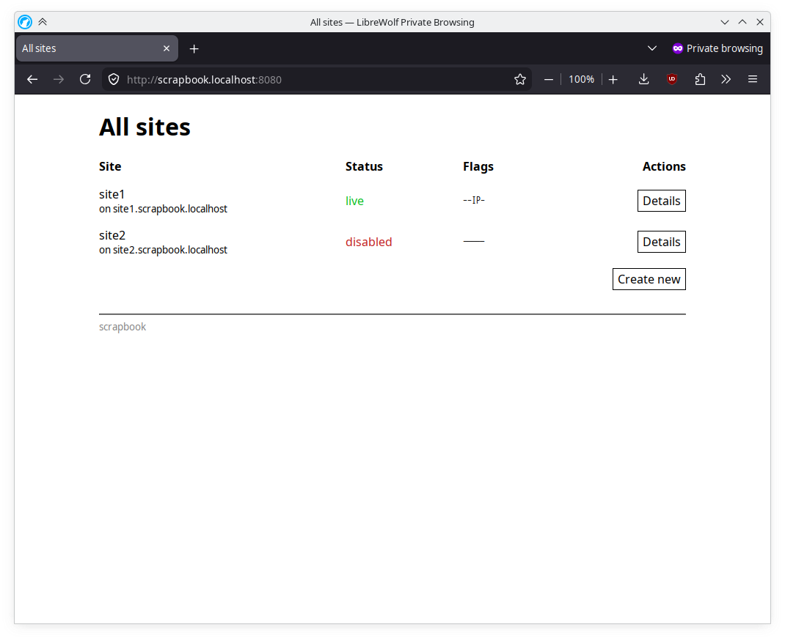
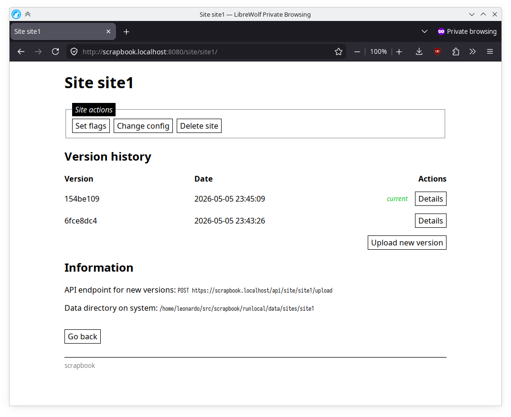
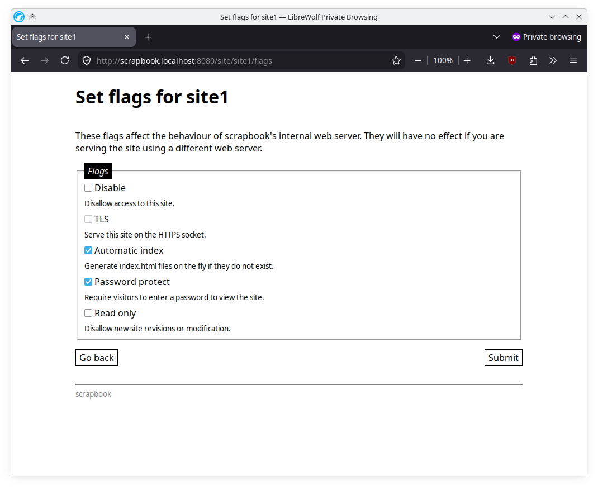
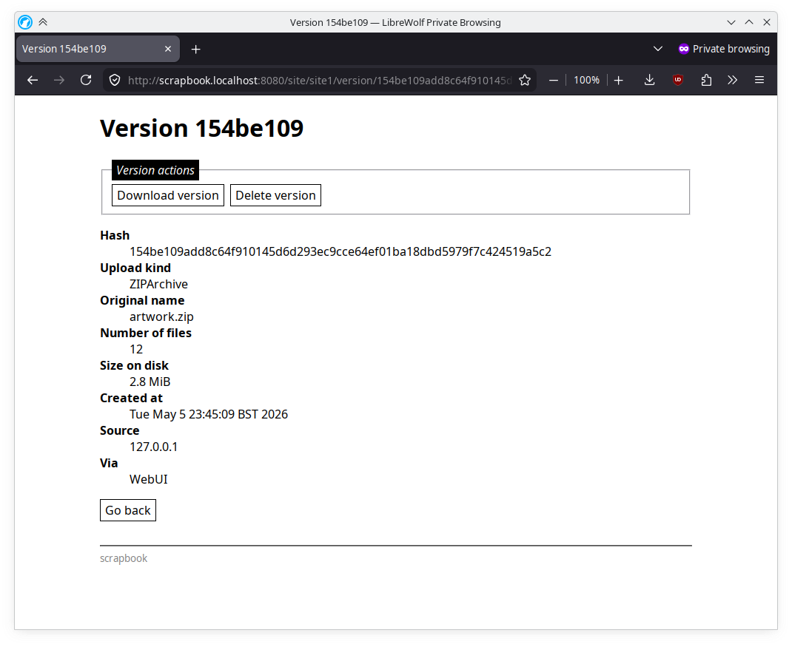

# scrapbook

Scrapbook is a website manager, built to deploy and serve statically generated
web pages. It's designed with the following goals:

* Individual sites per `Host` header
* Web management interface to create and deploy sites
* API for publishing new versions of sites (e.g. CI jobs)
* No database or Redis requirement

It was originally built for me to use in conjunction with my own
[static site generator](https://git.leonardobishop.net/panulat).

## Installation

This program is designed for Linux only. Install to `/usr/local/bin` with:

```bash
make
make install
```

There is a sample configuration file and service file in `contrib`. By default,
scrapbook will look for its configuration at `/etc/scrapbook/config`.

Alternatively, there is a provided `Dockerfile` if you wish to use a container.

```bash
docker build -t scrapbook .
docker run \
      -p "8080:80" \
      -v scrapbook_config:/etc/scrapbook  \
      -v scrapbook_data:/var/lib/scrapbook  \
      scrapbook
```

There are sample Docker Compose and Podman Quadlet files in `contrib`, along with
a sample configuration file.

## Configuration

You must set a hostname and secret for the web management interface and API. (I
collectively call these the 'Control' interfaces, as it is the way you issue
commands to scrapbook.)

```toml
listen "0.0.0.0:80"

control {
  host   ""
  secret ""
}
```

If either values are left blank, then the web management interface and API will
be inaccessible.

## Practical notes and recommended setup

**TLS.** Scrapbook currently has no support for TLS. I would recommend running it
behind a reverse proxy (I use nginx) and terminating TLS connections there before
passing them to scrapbook.

**Certificates / DNS.** On the topic of certificates, I would recommend getting a
wildcard certificate for the (sub-)domain you want to serve scrapbook sites with.
Couple this with a wildcard CNAME pointing to your webserver, and you can very
easily set up a new sites on different subdomains all within the scrapbook web
management interface.

## Screenshots





